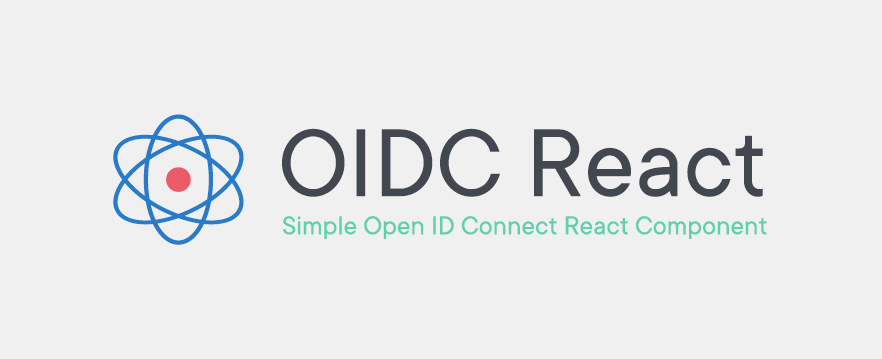

# OIDC React

[](https://github.com/prettier/prettier)
[](https://github.com/prettier/prettier)
[](http://commitizen.github.io/cz-cli/)
[](https://github.com/semantic-release/semantic-release)


[](https://lgtm.com/projects/g/bjerkio/oidc-react/context:javascript)
[](https://codecov.io/gh/bjerkio/oidc-react)
[](https://codeclimate.com/github/bjerkio/oidc-react/maintainability)



## About

React component (AuthProvider) to provide OpenID Connect and OAuth2 protocol support. Has [hooks](guides/HOOKS.md) 🎉

Based on [oidc-client-ts](https://github.com/authts/oidc-client-ts).

## Quickstart

Install packages by running:

```shell
$ npm install oidc-react
```

## Usage

```tsx
import { AuthProvider } from 'oidc-react';

const oidcConfig = {
  onSignIn: () => {
    // Redirect?
  },
  authority: 'https://oidc.io/oauth',
  clientId: 'this-is-a-client-id',
  redirectUri: 'https://my-app.com/',
};

const Routes = () => (
  <AuthProvider {...oidcConfig}>
    <Switch>
      <Route exact path="/">
        <Dashboard />
      </Route>
      ...
    </Switch>
  </AuthProvider>
);
```

# Documentation

Apart from this README, you can find details and examples of using the SDK in the following places:

- [SDK Documentation](docs/README.md)
- [Guides](guides/)
- [Example repository](https://github.com/simenandre/example-oidc-react)
- [oidc-client-ts Documentation](https://authts.github.io/oidc-client-ts/)

## Contribute & Disclaimer

We love to get help 🙏 Read more about how to get started in [CONTRIBUTING](CONTRIBUTING.md) 🌳
